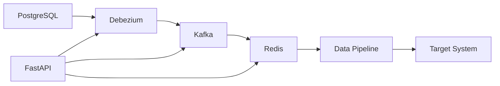

# Event-Driven Data Integration Service

## Overview
The **Event-Driven Data Integration Service** enables real-time data streaming and synchronization using **PostgreSQL, Debezium, Kafka, and Redis**. It captures changes from PostgreSQL through Debezium, streams them into Kafka topics, where events are aggregated in Redis. Once they exceed a specified threshold within a given timeframe, an automated data pipeline is triggered to load the processed data into the target system.

## Architecture



### Core Components
1. **PostgreSQL**: Primary database supporting Change Data Capture (CDC)
2. **Debezium**: Captures change events from PostgreSQL and streams to Kafka
3. **Kafka**: Central event broker storing and distributing change events
4. **Redis**: Caches events and aggregates counts, triggers pipeline when threshold exceeded
5. **FastAPI**: API endpoints to manage all services
6. **Data Pipeline**: Loads processed data into target system

## 📚 Documentation

### Service Documentation
- **[Debezium Service](./docs/debezium.md)** - Connector management and configuration
- **[Kafka Service](./docs/kafka.md)** - Topic management and operations
- **[Consumer Service](./docs/consumer.md)** - Event consumer management
- **[Redis Service](./docs/redis.md)** - Data caching and aggregation

### API Documentation
- **[API Reference](./docs/api.md)** - Complete API endpoint documentation
- **[Configuration Guide](./docs/configuration.md)** - Environment and service setup

## 🚀 Quick Start

### Setup & Execution
1. **Clone and navigate to the project**
   ```bash
   cd event-driven-debezeuim
   ```

2. **Start all services**
   ```bash
   docker-compose up -d
   ```

3. **Access the API**
   - API: http://localhost:8000
   - Docs: http://localhost:8000/docs
   - Redis CLI: `docker exec -it redis redis-cli`

## Configuration

### Environment Variables
Create a `.env` file in the root directory:

```env
# Kafka Configuration
KAFKA_BROKER="kafka:9092"
KAFKA_ZOOKEEPER="zookeeper:2181"

# Debezium Configuration
DEBEZIUM_CONNECTOR_URL="http://host.docker.internal:8083/connectors"

# Redis Configuration
REDIS_HOST="redis"
REDIS_PORT="6379"
REDIS_DB="0"

# PostgreSQL Configuration
POSTGRES_HOST="host.docker.internal"
POSTGRES_PORT="5432"
POSTGRES_USER="debezium"
POSTGRES_PASSWORD="password"
POSTGRES_DB="mydatabase"
```

### PostgreSQL Setup
See [Configuration Guide](./docs/configuration.md#postgresql-setup) for detailed PostgreSQL setup instructions.

